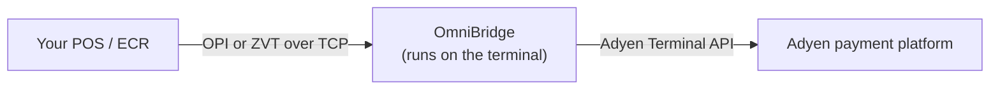

# OmniBridge for Adyen Android terminals

Run your OPI or ZVT POS system directly against an Adyen Android payment terminal.

OmniBridge is a protocol translation app that runs on the terminal itself. Your POS system sends payment requests over TCP in the protocol it already speaks. OmniBridge translates them into Adyen Terminal API calls, processes the payment, and returns the result in your POS system's own protocol. You do not need a separate device or a middleware server.



## About this repository

This repository distributes OmniBridge. It contains no source code.

Each release publishes the signed Android app together with both merchant guides. Everything you need to deploy OmniBridge comes from the [Releases](../../releases) page.

This repository is licensed under the [MIT License](LICENSE). The app bundles third-party open-source components, listed in [THIRD-PARTY-NOTICES.md](THIRD-PARTY-NOTICES.md).

## Capabilities

| Capability | Description |
|---|---|
| OPI protocol | XML over TCP, default port `5000`, 4-byte big-endian length prefix, ISO-8859-1 encoding. Covers payment, refund, reversal, login, logoff, and reconciliation. |
| ZVT protocol | Binary APDU over TCP: Authorization `06 01`, Refund `06 31`, Reversal `06 30`, End-of-Day `06 50`, Registration `06 00`, Log-Off `06 02`, Initialisation `06 93`, Diagnosis `06 70`, Abort `06 B0`, and Repeat-Receipt `06 20`. |
| Tap to Pay | Contactless payments through the Adyen POS app, without a hardware terminal connection. |
| Cashback | The ECR sends the cashback amount in ZVT TLV tag `0x1F25`. Adyen must activate cashback on the terminal. |
| Tipping | Terminal-prompted tipping for OPI and ZVT, plus ECR-declared inline tips in ZVT TLV `0x1F36`. |
| Dynamic Currency Conversion | Adyen-initiated. OmniBridge forwards the currency prompt to your ECR as an intermediate status message. |
| ECR receipt printing | Receipts are sent to your ECR with `06 D1` and `06 D3`, gated by the Registration config byte. |
| Intermediate status | Real-time transaction updates as `04 FF` APDUs when your ECR opts in through the config byte. |
| Device notifications | An outbound TCP channel to your ECR for receipts, login confirmations, and reconciliation. Default port `10101`. |
| QR code provisioning | A pipe-delimited QR code configures a terminal in one scan. Scanning is additive, so you can update single fields across a fleet. |
| Expert merchant reference | A configurable pattern builds the merchant reference sent to Adyen from placeholders such as the daily sequence, terminal serial, and timestamp. |
| Diagnostic log upload | Upload app logs and crash reports for support analysis. Card data is redacted. |
| Security | NexoCrypto encryption to the Adyen Terminal API, with credentials stored in the Android Keystore. |

## Requirements

| Requirement | Description |
|---|---|
| Adyen terminal | Any Adyen Android-based terminal (AMS1, S1F2, or another Android model) running Android 7.0 (API level 24) or later. |
| Customer Area access | Admin permissions in the Adyen Customer Area, test or live. |
| Terminal credentials | A boarded terminal with its terminal ID (POIID) and a NexoCrypto shared key. |
| POS system | A POS system that communicates over OPI (XML over TCP) or ZVT (binary over TCP). |
| Network | Your POS system and the terminal are on the same local network. |

## Download

1. Open the [latest release](../../releases/latest).
2. Download the assets you need.

| Asset | Description |
|---|---|
| `omnibridge-1.3.14.apk` | The signed OmniBridge app. You upload this to your Adyen Customer Area. |
| `merchant-quick-start-guide.pdf` | Set up a single terminal and take your first payment. |
| `merchant-configuration-guide.pdf` | The full configuration and troubleshooting reference. |

The release notes describe what changed in that version and list the SHA-256 checksum of the APK.

### Verify the download

Compare the checksum of the file you downloaded against the one in the release notes. If the two do not match, the file is incomplete or has been altered — download it again and do not upload it to your Customer Area.

On macOS and Linux:

```bash
shasum -a 256 omnibridge-1.3.14.apk
```

On Windows:

```
certutil -hashfile omnibridge-1.3.14.apk SHA256
```

## Install on your terminal

You do not install OmniBridge on the terminal by hand. You upload it to your Adyen Customer Area and assign it to the terminals that need it.

1. In the Adyen Customer Area, go to **In-person payments** → **Android**.
2. Upload `omnibridge-1.3.14.apk` to the app library.
3. Assign the app to your target terminals.
4. Each terminal downloads and installs OmniBridge on its next sync, typically within 15 to 30 minutes.
5. To apply the installation immediately, reboot the terminal from the Customer Area or physically.

On first launch, OmniBridge opens with a disconnected status and no configuration. This is expected. Continue with configuration.

## Configure OmniBridge

Collect your terminal ID and your NexoCrypto key identifier, passphrase, and version from the Customer Area before you touch the terminal. Configuration stalls without them.

| Guide | Use it when |
|---|---|
| **Quick-start guide** | You are setting up one terminal and want a working payment in about 10 minutes. It covers the settings passcode, terminal credentials, protocol selection, and a test payment. |
| **Configuration guide** | You need the full reference: Customer Area setup, QR code provisioning, OPI and ZVT protocol setup, Tap to Pay, display notifications, network and firewall requirements, multi-store rollout, security, and troubleshooting. |

Both guides ship as PDF attachments on every release.

## Versioning

OmniBridge uses `major.minor.patch` version numbers, for example `1.3.14`. The APK attached to a release is named `omnibridge-<version>.apk`.

Each release describes its changes in plain language, so you can decide whether an update is relevant to your deployment. The merchant guides carry their own version numbers and are re-attached whenever their content changes.

## Support

Use your standard Adyen Support channel for questions about OmniBridge, your terminal, or your Adyen account. This repository does not track support requests.

When you contact support, include the OmniBridge version shown in the Expert section of the Settings screen.

## Next steps

1. [Download the latest release](../../releases/latest) and verify its checksum.
2. Upload the APK to your Adyen Customer Area and assign it to a terminal.
3. Follow the quick-start guide to configure the terminal and take a test payment.
